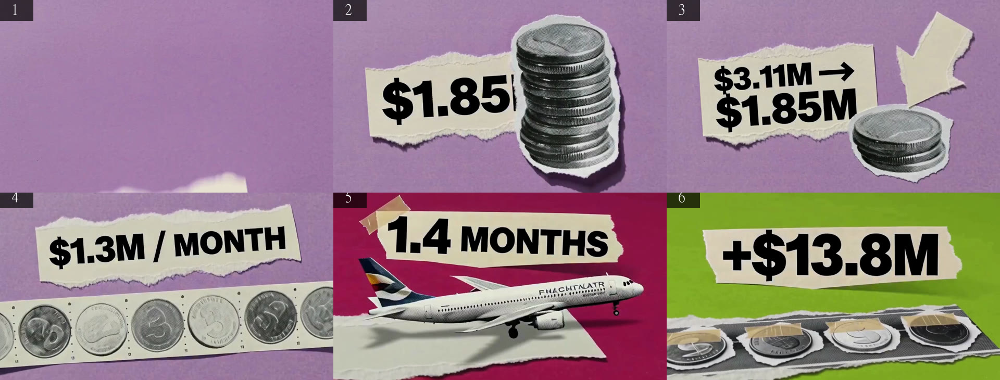
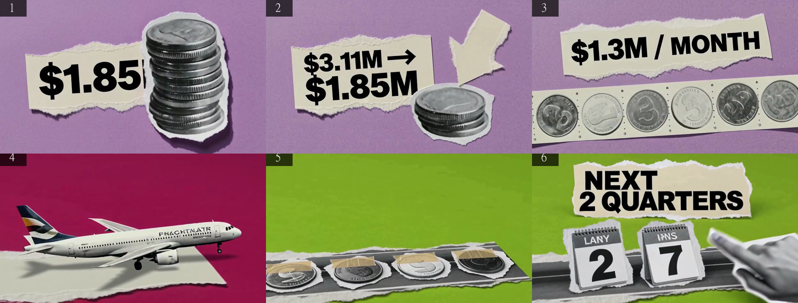
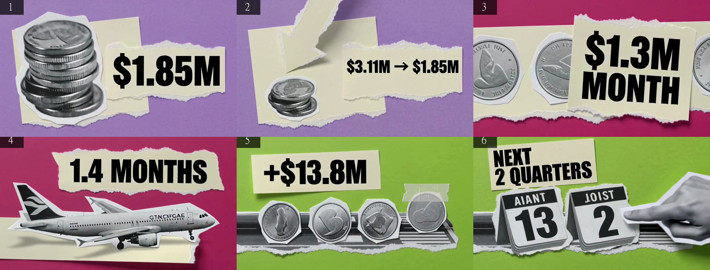
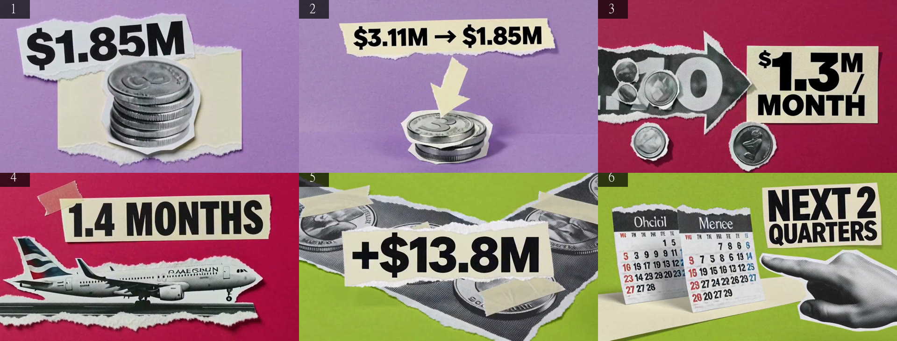

# WP0 — Report

All renders 4 September 2026, MiniMax H3 Max Turbo on fal, 480P, 16:9, 5 s, `prompt_expansion_mode: balanced`. Numbers come from `recordings/<session>/*.json` via `npm run report`; Whisper (openai-whisper `medium`, CPU) via `npm run whisper`. The three spine sessions render the same six pinned beats (the exemplar in `briefs/WP0.md`), so they compare like for like:

| session | VOICE | CHAIN | clips |
|---|---|---|---|
| `20260904-120800-…-native-chain-on` | native | on | 6 |
| `20260904-121503-…-saskia-chain-on` | saskia | on | 6 |
| `20260904-121916-…-native-chain-off` | native | off | 6 |

Reels (`recordings/reels/`): `spine-native-chained.mp4` (31 s), `spine-saskia-chained.mp4` (34 s, ElevenLabs narration mixed over the wordless clips at the player's offsets), `spine-chained-vs-unchained.mp4` (side by side, chained on the left with its native audio).

## 1. Render time per clip

| session | p50 | max | notes |
|---|---|---|---|
| native, chain on | 2 884 ms | 11 368 ms | beat 1 (text-to-video) waited in fal's queue; beats 2–6 2.4–3.5 s |
| saskia, chain on | 2 918 ms | 13 875 ms | beat 6 queued; beats 1–5 2.4–4.3 s |
| native, chain off | 2 455 ms | 2 913 ms | two in parallel, no queue waits in this run |
| all 76 clips today | 2 863 ms | 13 875 ms | p90 8 199 ms; text-to-video p50 2 629 ms, image-to-video p50 3 106 ms |

Wall clock from `fal.queue.submit` to the result, measured in the browser. fal's own `timings.inference` is 0.45–0.65 s per clip; the rest is queue wait, prompt expansion (~1 s) and upload. The tail (8–14 s) is queue variance, not the model: it hit one clip in most chained runs and none in the unchained run, which is too few runs to call a difference. A chained beat also pays ~1–1.5 s after its render to fetch the clip and grab the last frame before the next can start; unchained beats render two at a time and skip that.

Time to first frame after Enter: pinned spine 4–6 s when the queue is quiet (first beat at ~0.1 s + render + first fetch through the media proxy), up to ~12 s when beat 1 queues. Live-translated answers add the translator's time to first beat: 3.5 s and 4.7 s in the two live runs (10 beats each; 15.5 s and 17.6 s to the last beat, well inside the programme's own running time).

## 2. Cost

Post-promo H3 Max Turbo at 480P is $0.025 per second (brief). One 5 s clip: **$0.125**. Per 60 s of programme (12 clips): **$1.50**. A six-beat spine programme: $0.75 of video. On top of that, per new answer: one Claude Opus 5 translation (~5 k input tokens with the cached system prompt, ~1 k output; roughly $0.05–0.10, then cached) and, on Saskia, six ElevenLabs lines of ~90 characters (~550 characters per programme). I did not find the promo rate in the repo or brief; fal's dashboard has today's actual spend.

## 3. Whisper word-match per clip (native voice)

Word recall = words of the beat's line found in the transcript, in order, after reading digits the way the narrator is told to say them (`$1.85 million` ≡ `one point eight five million dollars`). Whisper writes numbers as digits, so without that normalisation the same clips score 67–77%.

| beat | line (words) | native, chain on | native, chain off |
|---|---|---|---|
| 1 | At the end of September, Diginex held one point eight five million dollars in cash. (15) | 100% | 100% |
| 2 | Six months earlier it was three point one one million — the burn shows a company mid-transition. (17) | 100% | 100% |
| 3 | Operating burn ran about one point three million a month. (10) | 100% | 100% |
| 4 | At that rate, the cash on hand covered roughly one point four months. (13) | 100% | 100% |
| 5 | An eleven point four million warrant exercise kept the company afloat — and October added thirteen point eight million more. (19) | 100% | **0% (silent)** |
| 6 | Survival depends on capital markets; the next two quarters show whether revenue can narrow the gap. (16) | **0% (silent)** | 100% |
| mean | | 83.3% | 83.3% |

When the model speaks, it speaks the line word for word: 10 of 10 spoken clips at 100%. In each run one clip of six produced no speech at all (a different beat each time), so the native voice's reliability today is 5/6 per programme, not its accuracy. Note the exemplar's beat 5 is 19–20 words, over the 18-word limit; `npm run check` flags it. Whisper hears nothing but its usual silence hallucination ("Thanks for watching!") on the Saskia clips: audio block B does keep them wordless, 6/6.

## 4. Voice consistency 1–5 across the six spine clips

Scored by Robin after listening to the reels; the proxies are the builder's:

| | native | saskia |
|---|---|---|
| clips with speech | 5/6 (both native runs) | 6/6 (one ElevenLabs track per line; one needed a retry after a 429 concurrency error, now capped at two in flight) |
| same voice clip to clip | not measurable here (a different narrator is possible per clip; the prompt asks for one) | by construction (one voice id) |
| words as written | 100% on the spoken clips | not measured (TTS) |
| timing | tied to the clip | sentence-to-clip, no tight sync; the reel and the player start line N at clip N or when line N−1 ends |
| voice consistency 1–5 | **3** — female voice on clip 1, then male and consistent for the rest; one clip rushed | **5** — a single voice throughout |

Follow-ups noted on Saskia: the delivery is flat, and the sentence-to-clip alignment is loose.

## 5. Contact sheets

First frames, native chain on (`WP0-contact-sheet-first-frames.jpg`). With CHAIN=on every clip after the first opens on the previous clip's last frame, so the first frame of beat N is beat N−1's closing composition: the match cut is literal. Beat 1 opens on bare ground.

Mid frames, native chain on (`WP0-contact-sheet-mid-frames.jpg`):

Mid frames, saskia chain on (`WP0-contact-sheet-saskia-mid-frames.jpg`):

Mid frames, native chain off (`WP0-contact-sheet-unchained-mid-frames.jpg`):

Mid frames of a live translation, `What is Diginex`, 10 beats (`WP0-contact-sheet-live-translation-mid-frames.jpg`): grounds hold in runs of two or three as the prompt asks; headlines are the translator's own.

## 6. Which style-sheet lines survive in `expanded_prompt`

fal's rewriter turns the prompt into a structured description (`integrated_multimodal_description`, `overall_soundscape`, …). Per line, counted as surviving when a phrase from it or a clear paraphrase appears in the rewritten prompt (18 spine clips; `npm run report` prints the per-clip grid):

| line | survives | what happens |
|---|---|---|
| 1 collage / magazine / 2D motion | 18/18 | copied |
| 2 one flat block-colour ground | 18/18 | copied, with the colour named |
| 3 halftone cutouts, torn-paper edges, no faces | 18/18 | copied |
| 4 paper shapes, ribbons, tape, print dots | 16/18 | mostly copied |
| 5 upper-left light, paper-layer shadows | 18/18 | copied |
| 6 flat matte, no glow / neon / bloom | 11/18 | often reduced to "matte" or dropped |
| 7 headline type on paper chips, exact letterforms | 18/18 | copied |
| 8 motion: fast entry, overshoot, reading window, no shake, loop | 18/18 | copied, often as "Static Shot" plus a subtle loop |
| 9 numbers printed complete, never counting up | **0/18** | dropped every time |
| 10 no brands, logos, watermarks, text beyond the copy list | **0/18** | dropped every time |
| 11 16:9, exactly 5 s, one composition, one cut | 7/18 | usually reduced to "[Shot 1]" |
| 12 identity anchor (torn edges + upper-left shadow) | 17/18 | copied (it repeats lines 3 and 5) |

The two lines that never survive are the two prohibitions, and the clips show it: extra text on props and a livery on the aircraft (below). The numbers line being dropped did not hurt in practice today (section 7), but nothing in the rewritten prompt protects it.

## 7. Headline and number render accuracy per clip

Judged from the mid-clip frame (and, for chained runs, the next clip's first frame, which is the closing frame). "Exact" = every character of the copy list as written, complete from its first visible frame in the frames inspected; numbers were never seen counting up or morphing in the frames inspected.

| beat | copy list | native, chain on | saskia, chain on | native, chain off |
|---|---|---|---|---|
| 1 | `$1.85M` | partial: the coin stack lands over the chip and hides the `M` for most of the clip | exact | exact |
| 2 | `$3.11M → $1.85M` | exact (arrow glyph rendered) | exact, small | exact |
| 3 | `$1.3M / MONTH` | exact | exact (no slash, two lines) | exact (two lines) |
| 4 | `1.4 MONTHS` | late: absent at mid-clip, present at the end frame | exact | exact |
| 5 | `+$13.8M` | exact, arrives mid-clip | exact | exact |
| 6 | `NEXT 2 QUARTERS` | exact | exact | exact |
| exact at mid-clip | 4/6 | 6/6 | 6/6 |

Numbers: 18/18 correct as printed; no wrong digit, no missing symbol. Extra text the copy list did not ask for, all runs: pseudo-words on the calendar pages ("LARY", "IINS", "AIANT", "JOIST", "Ohciol", "Menee"), lettering and an airline-style tail livery on the aircraft cutout in beat 4 (a brand-like mark, style-sheet line 10), and small print on coins and documents. Faces: none in 18 spine clips or 20 live-translation clips; the paper hand in beat 6 is anonymous as specified.

Chained runs inherit the previous composition, which is what makes the cut seamless and also what let beat 1's coin stack cover its headline and pushed beat 4's headline to the end of the clip. Unchained clips compose each headline fresh and were exact 6/6, at the price of a hard cut every five seconds (see the side-by-side reel).

## 8. Translator (live path)

Two answers went through Claude today, both 10 beats, 0 dropped: `What is Diginex` (first beat 4.7 s, done 17.6 s) and `What are the key risks for Diginex?` (3.5 s, 15.5 s). Soft warnings: one 19-word line, one headline (`4 ACQUISITIONS`) whose digit is a count of names in the cited sentence rather than a figure in it. Every beat cited sentences; `npm run check` reports 0 beats without a source across all recordings and cached translations, 5 warnings (three of them the exemplar's and the live runs' line lengths).

## 9. Runtime observations

- No blank frames between clips in any run after the two-slot screen went in: every swap logged `readyState` 3 or 4 (first frame decoded) at the moment of the cut. With a late clip the screen holds the last frame; the longest hold today was ~9 s (beat 2 of the interrupt test, which queued for 12.9 s).
- Interrupt mid-beat 2: the picture held on beat 2, the in-flight render for beat 3 was cancelled (`[session] cancelled 1 render(s) in flight`, 2 clips recorded, not 3), and the new answer's beat 1 cut in ~8 s later.
- Unchained (parallel) rendering played beats out of order until the stream was made to hand clips over in writing order; fixed and re-run.
- ElevenLabs: five concurrent requests allowed on this key; the narrator now holds at two.
