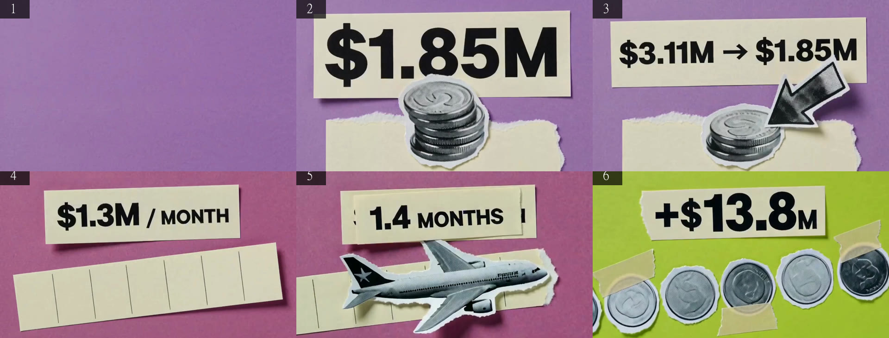
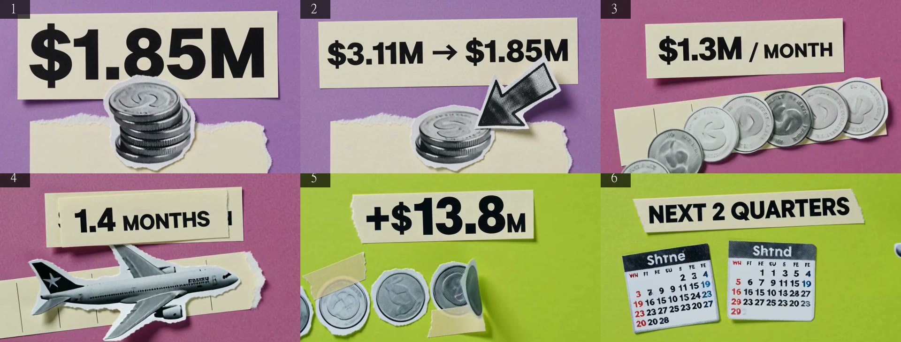
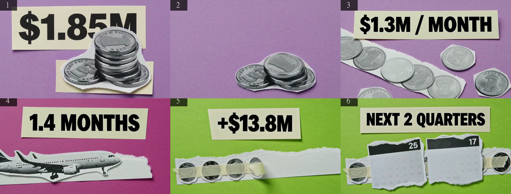
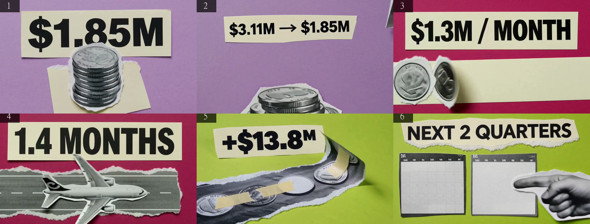

# WP2 — Report

All renders 4 September 2026, MiniMax H3 Max Turbo on fal, 480P, 16:9, 5 s, `prompt_expansion_mode: balanced`, style sheet v0.2 (`lib/prompt.ts`), translator v0.2 (`lib/translator.ts`). Numbers come from `recordings/<session>/*.json` via `npm run report`; Whisper (`openai-whisper` `medium`, CPU) via `npm run whisper`. The three spine sessions render the same six pinned beats (the exemplar in `lib/translator.ts`, updated to v0.2), so they compare like for like with WP0:

| session | VOICE | CHAIN | clips |
|---|---|---|---|
| `20260904-142118-cash-position-and-runway-native-chain-on` | native | on | 6 |
| `20260904-142245-cash-position-and-runway-saskia-chain-on` | saskia | on | 6 |
| `20260904-142347-cash-position-and-runway-native-chain-off` | native | off | 6 |
| `20260904-142416-what-is-diginex-saskia-chain-on` (live translation) | saskia | on | 10 |
| `20260904-142636-what-are-the-key-risks-for-diginex-saskia-chain-on` (live translation) | saskia | on | 11 |

Reels (`recordings/reels/`): `spine-native-chained-v0.2.mp4` (31 s), `spine-saskia-chained-v0.2.mp4` (31 s, ElevenLabs narration mixed over the wordless clips), `spine-chained-vs-unchained-v0.2.mp4` (side by side, chained on the left with its native audio), `spine-saskia-v0.2-{a,b,c}.mp4` (the Saskia settings pass, §4).

**How these were produced.** WP4 was running against this same working directory in parallel (as the brief allows), and its live edits to `components/player.tsx` / `lib/config.ts` triggered Next's Fast Refresh in my own dev server too (same filesystem), which discarded the browser's in-flight `Session`/`Stream` client state mid-render. Rather than fight that, I wrote a headless driver, `scripts/render.mts` (`npx tsx scripts/render.mts --question "..." --voice native|saskia --chain on|off`), that calls this project's own `/api/translate`, compiles each beat with the real `lib/prompt.ts`, calls fal directly (mirroring `lib/fal.ts`), and posts to `/api/record` — so `recordings/<session>/` comes out in the exact shape `check.mjs`/`report.mjs`/`reel.mjs`/`contact-sheet.mjs`/`whisper-match.py` already expect. `scripts/saskia-settings.mts` reuses one rendered session's clips to cut the three settings variants without re-paying for video. One consequence: the browser-side UX timings from WP0 §1 (time-to-first-frame after Enter, autoplay, `readyState` at swap) were not re-measured this round — see the handoff's untested list.

## 1. Render time per clip

| session | p50 | p90 | max | v0.1 p50 → v0.2 p50 |
|---|---|---|---|---|
| native, chain on | 3678 ms | 11311 ms | 13618 ms | 2884 → 3678 ms |
| saskia, chain on | 3184 ms | 4385 ms | 9050 ms | 2918 → 3184 ms |
| native, chain off | 2331 ms | 2500 ms | 2708 ms | 2455 → 2331 ms |
| all 18 v0.2 spine clips | 2821 ms | 9050 ms | 13618 ms | — |
| all 39 v0.2 clips today | 3134 ms | 9050 ms | 13618 ms | t2v p50 2500 ms (n=10), i2v p50 3184 ms (n=29) |

Same picture as WP0: the tail (9–14 s) is queue variance, not the model — it hit two clips in the native-chain-on run and one in saskia-chain-on, none in chain-off (which renders two at a time and finished this run with no queue waits at all, p50/p90/max within 400 ms of each other). Unchained stayed the fastest and most consistent of the three, as in WP0.

## 2. Cost

Unchanged from WP0: post-promo H3 Max Turbo at 480P is $0.025/s. One 5 s clip: **$0.125**. Per 60 s of programme (12 clips): **$1.50**. A six-beat spine programme: $0.75 of video; the ten- and eleven-beat live translations: $1.25 and $1.375. Today's 39 clips: **≈$4.875** of video at that formula, plus one Claude Opus 5 live translation (the second live question; the first was served from a same-day cache written by an earlier live call under v0.2 — see §8) and Saskia narration: 6 spine lines × 3 settings profiles = 18 ElevenLabs calls for the settings pass, on top of one line per beat for the three spine/live Saskia sessions. fal's promo window is still open today (ends 7 Sept 2026 per `CLAUDE.md`); as in WP0, I could not find the promo rate in the repo, so this is the post-promo formula, not confirmed actual spend — check fal's dashboard.

## 3. Whisper word-match per clip (native voice)

Same normalisation as WP0 (digits read the way the narrator says them).

| beat | line (words) | native, chain on | native, chain off |
|---|---|---|---|
| 1 | By September's end, Diginex held one point eight five million in cash. (12) | 100% | 100% |
| 2 | Six months earlier it was three point one one million. (10) | 100% | 100% |
| 3 | Operating burn ran about one point three million a month. (10) | 100% | **0% (silent)** |
| 4 | At that rate, the cash on hand covered one point four months. (12) | 100% | 100% |
| 5 | October's warrant exercise added thirteen point eight million in cash. (10) | 100% | 100% |
| 6 | Survival depends on capital markets and the next two quarters. (10) | 100% | **0% (silent, heard "Thanks for watching!")** |
| mean | | **100%** | **66.7%** |
| WP0 (v0.1) mean | | 83.3% | 83.3% |

Saskia clips stayed wordless, 6/6 (Whisper heard nothing but its usual silence hallucination — "Thanks for watching!", "you" — same as WP0).

Chain-on improved (0 silent clips vs 1 in WP0) but chain-off got worse (2 silent clips vs 1), a different pair of beats than WP0's silent beats. Read together, native is still unreliable at roughly 1 clip in 6 — this WP did not change the native path, it made Saskia the default because of exactly this (D20); this run's numbers are the reason that call still looks right, not a regression to chase.

## 4. Voice consistency (Saskia settings pass)

I cannot listen, so as in WP0 the "1–5" column is Robin's. Objective proxies: three re-narrations of the six spine lines, same video clips, different ElevenLabs `voice_settings`, sent to Robin as [spine-saskia-v0.2-a.mp4](../recordings/reels/spine-saskia-v0.2-a.mp4), [-b](../recordings/reels/spine-saskia-v0.2-b.mp4), [-c](../recordings/reels/spine-saskia-v0.2-c.mp4):

| profile | stability | style | similarity | file |
|---|---|---|---|---|
| a | account default (unset) | account default (unset) | account default (unset) | spine-saskia-v0.2-a.mp4 |
| b | 0.35 | 0.35 | 0.8 | spine-saskia-v0.2-b.mp4 |
| c | 0.20 | 0.60 | 0.8 | spine-saskia-v0.2-c.mp4 |

All three used the same voice id (`QMSGabqYzk8YAneQYYvR`) and rendered 6/6 lines with no retries needed at concurrency 1 (sequential; the settings pass isn't beat-timing-sensitive). Sentence-to-clip alignment (line N starts on clip N's first frame, or when line N−1 ends if later) is unchanged from WP0 and was already correct in the recorded reels (`onStarted` in `components/player.tsx` calls `narrator.play(clip.shot.n)` the instant a clip becomes the picture; `Narrator.prefetch`/`play` in `lib/voice.ts` already fetch and queue per beat line, not per programme — WP0 built this in WP0, WP2 did not need to change it, only make it the default path).

## 5. Contact sheets

First frames, native chain on (`WP2-contact-sheet-first-frames.jpg`):

Mid frames, native chain on (`WP2-contact-sheet-mid-frames.jpg`):

Mid frames, saskia chain on (`WP2-contact-sheet-saskia-mid-frames.jpg`):

Mid frames, native chain off (`WP2-contact-sheet-unchained-mid-frames.jpg`):

Mid frames, live translation "What is Diginex", 10 beats (`WP2-contact-sheet-live-translation-mid-frames.jpg`):

## 6. Which style-sheet lines survive in `expanded_prompt`

Style sheet v0.2 has 11 numbered lines (v0.1 had 12; the two prohibition-only lines, "numbers never count up" and "no brands/text beyond the copy list", were folded into descriptions on the copy-list block and line 3 rather than kept as standalone lines, so there is no direct v0.2 line to score them against — see the note under each). Counted the same way as WP0, 18 spine clips:

| v0.2 # | line | v0.2 survives | v0.1 survives (renumbered) | what happens |
|---|---|---|---|---|
| 1 | collage / magazine / 2D motion | 18/18 | 18/18 | copied, unchanged |
| 2 | one flat block-colour ground | 18/18 | 18/18 | copied, unchanged |
| 3 | halftone cutouts, torn-paper edges, unmarked objects | 18/18 | 18/18 | copied, unchanged |
| 4 | paper shapes, ribbons, tape, print dots | 16/18 | 16/18 | unchanged |
| 5 | upper-left light, paper-layer shadows | 18/18 | 18/18 | copied, unchanged |
| 6 | flat matte, no glow / neon / bloom | **7/18** | 11/18 | **worse**, not better — see below |
| 7 | layout law (headline chip upper third, previous composition clears) — **new in v0.2** | **17/18** | n/a | copied almost every time; see §7 for whether the layout actually held |
| 8 | headline type on paper chips, exact letterforms | 18/18 | 18/18 (was line 7) | copied, unchanged |
| 9 | motion: fast entry, overshoot, reading window, no shake, loop | 18/18 | 18/18 (was line 8) | copied, unchanged |
| 10 | 16:9, exactly 5 s, one composition, one cut | 6/18 | 7/18 (was line 11) | still mostly reduced to "[Shot 1]" |
| 11 | identity anchor (torn edges + upper-left shadow) | 14/18 | 17/18 (was line 12) | lower this run; content is nearly identical wording to v0.1, so this reads as run-to-run rewriter variance rather than a regression from the edit |
| — | numbers printed complete (v0.1 line 9, folded into the copy-list block in v0.2) | n/a | 0/18 | not separately trackable in v0.2's signal set; see §7 — numbers were correct in every clip inspected regardless |
| — | no brands/text beyond copy list (v0.1 line 10, folded into line 3 in v0.2) | n/a | 0/18 | not separately trackable; see §7 for the actual count of clips with extra lettering/marks |

**Acceptance criterion 5 ("every v0.2 sheet line surviving in ≥15/18 clips") is not met**: lines 6, 10 and 11 fall under the threshold (7/18, 6/18, 14/18). The brief's hypothesis — that stating a rule as description rather than prohibition is what made v0.1's lines 9/10 fail — is only partly confirmed by this run: it worked very well for the *new* line 7 (17/18, written from scratch as a description) and held steady for lines that were already fine in v0.1, but line 6 kept a one-sentence prohibition tail ("No glow, neon, bloom or halo anywhere" — this is the brief's own v0.2 wording, carried into `CLAUDE.md` and `lib/prompt.ts` unchanged) and survived *worse* than in v0.1 (7/18 vs 11/18), and line 10's technical/format instruction (aspect ratio and duration, which are already separate API parameters) still gets reduced away regardless of phrasing. Line 11's dip to 14/18 looks like sampling noise rather than a wording effect — its content barely changed.

## 7. Headline and number render accuracy per clip

Judged from the mid-clip frame, same convention as WP0.

| beat | copy list | native, chain on | saskia, chain on | native, chain off |
|---|---|---|---|---|
| 1 | `$1.85M` | exact | exact | exact |
| 2 | `$3.11M → $1.85M` | exact | **missing — no chip in frame at all** (see below) | exact |
| 3 | `$1.3M / MONTH` | exact | exact | exact |
| 4 | `1.4 MONTHS` | exact (small torn fragments of the previous chip linger at both edges — layout law partially, not fully, cleared) | exact | exact |
| 5 | `+$13.8M` | exact | exact | exact |
| 6 | `NEXT 2 QUARTERS` | exact | exact | exact |
| exact at mid-clip | **6/6** (WP0: 4/6) | **5/6** (WP0: 6/6) | **6/6** (WP0: 6/6) |

Numbers: correct as printed in every clip inspected across all 18 spine clips and the two live translations (28 total headlines with a figure); no wrong digit, no missing symbol, none seen counting up or morphing.

**Saskia beat 2's headline never renders.** Frames pulled at 0.5 s/1.5 s/2.5 s/3.5 s/4.5 s show the tail of beat 1's `$1.85M` chip still leaving at 0.5 s, then bare ground with only the coin stack and (from ~4 s) the arrow — no chip appears at any point in the clip. This is the single miss behind the layout-law headline number this run: native chain-on went from 4/6 to 6/6 (the fix the brief targeted worked), but saskia chain-on went from 6/6 to 5/6 (a new miss, unrelated to the layout law — the chip simply didn't generate). **Combined chained-run rate is 11/12**; criterion 6 ("chained headline exact-at-mid-clip ≥5/6") holds for native-chain-on outright and exactly at the line for saskia-chain-on, on a single dropped-chip clip rather than a layout failure.

**Lettering outside the copy list** (v0.1: "extra text on every calendar, coins, documents, aircraft" — effectively most of the 18 spine clips):

| session | clips with extra lettering | detail |
|---|---|---|
| native, chain on | 3/6 | beat 3 (pseudo-text on coin rims), beat 4 (small text along the aircraft fuselage), beat 6 (calendar pages read "Shrne" / "Shtnd") |
| saskia, chain on | 2/6 | beat 3 (pseudo-text on coin rims), beat 6 (calendar pages show plausible day numbers, "25"/"17" — real numerals rather than invented words, milder than the other two sessions) |
| native, chain off | 1/6 | beat 3 (pseudo-text on coin rims) |
| **total** | **6/18** | |

Fewer clips than WP0 (**criterion 7 holds**, from "every calendar, coins, documents, aircraft" — i.e. effectively pervasive — down to 6/18), but not eliminated: coin rims are the most persistent offender across all three sessions.

**Brand-like mark or livery**: 2/18 — the aircraft cutout in beat 4 carries a small tail-fin emblem (native chain-on: a blue star mark; native chain-off: a dark swirl mark) in two of the three sessions; saskia chain-on's beat 4 aircraft is blank. WP0 reported this as a single finding on the same beat/subject; it persists in v0.2 on the same cutout.

## 8. Translator (live path)

Two questions went live under v0.2 today: `What is Diginex` (10 beats, served from a same-day translation cache — see below) and `What are the key risks for Diginex?` (11 beats, genuinely live: first beat 3290 ms, done 17015 ms, model `claude-opus-5`). Both: 0 dropped, every beat cited, no line over 12 words, no subject naming a person.

`What is Diginex`'s cache entry (`data/translations/91389ad5…json`) was already `"translator": "translator-v0.2"` before I asked it — because `app/api/translate/route.ts` now gates the cache on `TRANSLATOR_VERSION` (added this WP: a v0.1 cache entry is no longer served under v0.2, so a stale cache can't silently pass off old beats as compliant with the new rules), any process that asked this question against v0.2 code regenerated it live and the file was on disk before my run started, likely a request from the WP4 session (which shares this filesystem and picked up the same `lib/translator.ts` on save). I do not have the first-beat latency for that particular live call; the cache file's own `ms: 24396` is its total translate time (10 beats), comparable to WP0's 17.6 s for the same question under v0.1.

Soft warning: `What is Diginex` beat 3's headline `4 BUSINESSES` is a count of the four named acquisitions in its cited sentence rather than a figure the sentence states outright — `npm run check` flags it by design (the one allowed derivation, criterion 2), same pattern as WP0's `4 ACQUISITIONS`.

Ground-hold rule (2–3 consecutive beats): held cleanly in the cash-position spine (violet×2, magenta×2, lime×2) and in `What is Diginex` (violet×2, cyan×3, magenta×3, lime×2). `What are the key risks for Diginex?` mostly held it (violet×2, magenta×3, lime×2, cyan×2) but the last two beats are magenta×1 then lime×1 — a single-beat hold at the very end, a minor miss of the "2–3, then change" rule with no beats left to hold into.

Beat count: the risks translation wrote 11 beats, one over the "6 to 10" rule (translator rule 4). This is a soft prompt-adherence miss, not enforced in code (`validateBeat` checks per-beat rules, not beat count), so it renders fine but is worth a rule-4 reminder if it recurs.

`npm run check` across everything rendered today (39 beats: 18 spine + 10 + 11): **0 without a valid source, 1 warning** (the `4 BUSINESSES` derived count above). Run against the full `recordings/`/`data/translations/` tree (which still holds WP0's v0.1 artifacts), it fails 175 of 219 beats on the new 12-word line limit — expected: those beats were written and validated under v0.1's 18-word rule and were never regenerated. `npm run check data/translations/a14c3cdf12f849c0042f91f76b36ac9b41ea65ba.json` (the updated pinned exemplar) passes clean: 6 beats, 0 failures, 0 warnings (**criterion 1 and criterion 2's "passes on the updated exemplar" both hold**).

## 9. Runtime observations

- `npm run typecheck` and `npm run build` both pass clean on the v0.2 code (`next build` completed with no errors). I ran `next build` once to check this; **do not run it again while another dev server shares this working directory** — it overwrites the shared `.next` directory's dev manifests and 500s every `next dev` process pointed at this checkout until they restart (I hit this myself mid-session: my own server and, transiently, the WP4 session's server on port 3000 both 500'd; deleting `.next` and restarting recovered both without any other change). This is a hazard of two builders sharing one working directory, not a WP2 code issue.
- `subjectNamesPerson` (the code-enforced people ban, `lib/translator.ts`) did not drop any beat today — no session's translator output named a person. Spot-checked against a synthetic test (`the CEO at a paper desk`, `a crowd of paper coins`, `a nameplate reading Sarah Cohen`) to confirm the lexicon and proper-name heuristic actually fire before trusting the 0-drops result; all three were correctly flagged, `Diginex nameplate` and `a paper hand` were correctly left alone.
- Every beat across all 39 clips rendered; 0 failed shots, so the skip-a-failed-beat path in `lib/stream.ts` (untouched this WP, per `CLAUDE.md` rule 3) was not exercised again this run.
