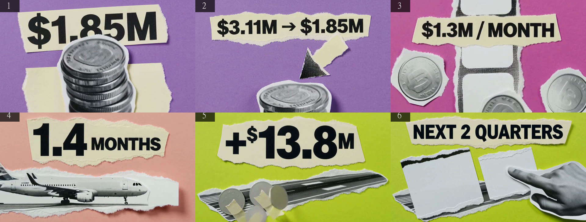
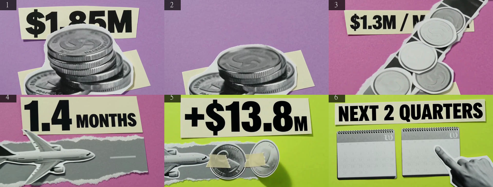
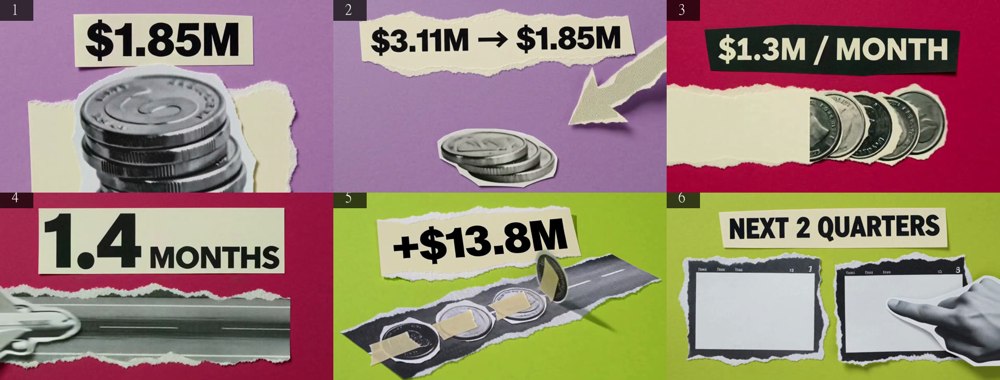
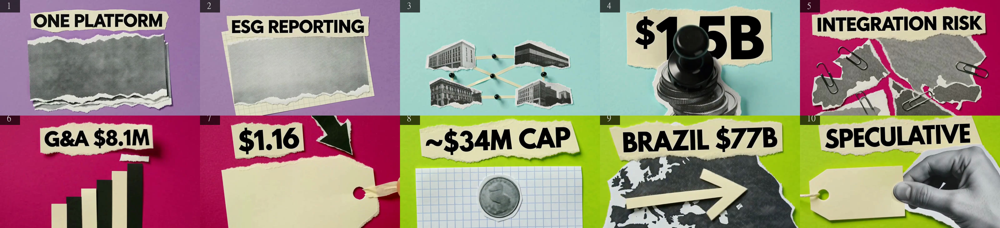
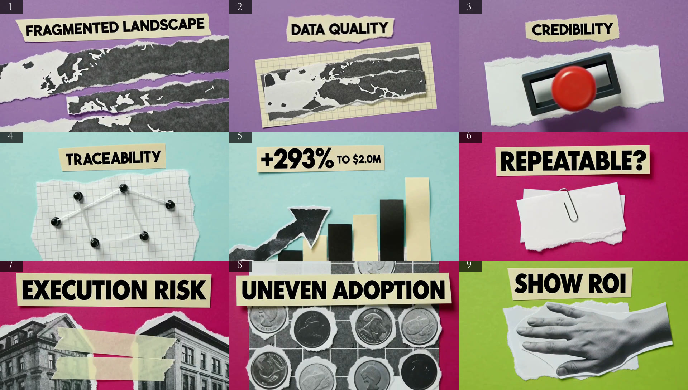

# WP3 — Report

All renders 4 September 2026, MiniMax H3 Max Turbo on fal, 480P, 16:9, 5 s, `prompt_expansion_mode: balanced`, style sheet v0.3 (`lib/prompt.ts`), translator v0.3 (`lib/translator.ts`). Built in a separate git worktree (`../tessera-wp3`, branch `wp3`) against its own dev server on port 3100, per CLAUDE.md rule 8 — another session already had a dev server live in the main checkout when this WP started. Numbers come from `recordings/<session>/*.json` via `npm run report`; Whisper (`openai-whisper` `medium`, CPU) via `npm run whisper`; `scripts/render.mts` (WP2) drove all five sessions. Same three spine sessions as WP0/WP2 (the pinned six-beat "cash position and runway" exemplar, now carrying `hero`/`scale`/`delivery`), plus the same two live translations:

| session | VOICE | CHAIN | clips |
|---|---|---|---|
| `20260904-161225-what-is-the-cash-position-and-runway-native-chain-on` | native | on | 6 |
| `20260904-161600-what-is-the-cash-position-and-runway-saskia-chain-on` | saskia | on | 6 |
| `20260904-161759-what-is-the-cash-position-and-runway-native-chain-off` | native | off | 6 |
| `20260904-162317-what-is-diginex-saskia-chain-on` (live translation, from cache written earlier this session) | saskia | on | 10 |
| `20260904-162821-what-are-the-key-risks-for-diginex-saskia-chain-on` (live translation, genuinely live) | saskia | on | 9 kept, 1 dropped |

Reels (`recordings/reels/`): `spine-native-chained-v0.3.mp4`, `spine-saskia-chained-v0.3.mp4` (ElevenLabs narration mixed over the wordless clips), `spine-saskia-v0.3-plain.mp4` / `spine-saskia-v0.3-tagged.mp4` (§4, the delivery-tag comparison, plus `spine-saskia-v0.3-requests.json`), `live-what-is-diginex-tagged-v0.3.mp4` (the live-translation reel).

**A word on today's fal reliability.** Every session this WP hit repeated `500 downstream_service_error` responses from fal's H3 Max Turbo endpoint — confirmed by hand with a bare `fal.queue.submit`/`result` call outside this project's code, so it is fal/MiniMax-side, not a WP3 regression. `scripts/render.mts` now retries a failed `generateClip` up to twice with backoff (2 s, 4 s) before giving up; this got every session through, but render times below are inflated by retries and are **not comparable to WP0/WP2's render-time tables** — read §1 as "the pipeline survived a bad fal day," not as a speed measurement.

## 1. Render time per clip

| session | p50 | max | retries hit |
|---|---|---|---|
| native, chain on | 34077 ms | 69767 ms | beats 1, 3, 4, 6 |
| saskia, chain on | 4072 ms | 39218 ms | beat 2 |
| native, chain off | 14169 ms | 78421 ms | beats 2, 4 (×2), 6 (×2) |
| live, saskia chain on (10 beats) | 3952 ms | 108903 ms | beats 1, 2 (both first attempt) |
| live, saskia chain on (9 beats) | 3212 ms | 4156 ms | none |
| all 18 spine clips | 7919 ms | 78421 ms | — |
| all 37 clips today | 3987 ms | 108903 ms | — |

## 2. Cost

Unchanged formula from WP0/WP2: post-promo H3 Max Turbo at 480P is $0.025/s. One 5 s clip: **$0.125**. Today's 37 clips (18 spine + 10 + 9): **$4.625** of video, plus 25 ElevenLabs calls across the three saskia/live sessions and 12 more from the `saskia-delivery.mts` plain/tagged pass (37 ElevenLabs calls total) — no per-call $ figure is in CLAUDE.md, so this is a call count, not a cost, matching WP0/WP2.

## 3. Whisper word-match per clip (native voice)

Same normalisation as WP0/WP2.

| beat | line (words) | native, chain on | native, chain off |
|---|---|---|---|
| 1 | By September's end, Diginex held one point eight five million in cash. (12) | 100% | 100% |
| 2 | Six months earlier it was three point one one million. (10) | 100% | 100% |
| 3 | Operating burn ran about one point three million a month. (10) | 100% | 100% |
| 4 | At that rate, the cash on hand covered one point four months. (12) | 100% | 100% |
| 5 | October's warrant exercise added thirteen point eight million in cash. (10) | 100% | 100% |
| 6 | Survival depends on capital markets and the next two quarters. (10) | 100% | 100% |
| mean | | **100%** | **100%** |
| WP2 (v0.2) mean | | 100% | 66.7% |

Both native sessions clean this round — chain-off's two silent clips from WP2 did not recur. Native path is untouched by WP3 (translator/sheet changes only), so read this as the same ~1-in-6 miss rate WP0/WP2 measured, not eliminated, at n=6 per session; Saskia stays the default (D20) regardless.

## 4. Delivery tags (Saskia expressive voice)

`app/api/voice/route.ts` now calls ElevenLabs' `eleven_v3` (the current model that honours square-bracket audio tags) and sends `delivery`, not `line`; no `voice_settings` override (WP2 found the three tuned profiles indistinguishable, so this matches the "account default" profile that pass actually tested, not an untested hand-picked one). Every request is logged to `recordings/<session>/voice-<n>.json` beside the mp3 (model, voice id, settings, text, duration, timestamp) — the gap WP2's review flagged for the settings-pass script is closed for `scripts/saskia-delivery.mts` too (`spine-saskia-v0.3-requests.json`).

Tagged beats in the pinned spine exemplar (3 of 6, matching the brief's "roughly three" target — opener, one turn, the hero beat, none on the close):

| beat | headline | tag |
|---|---|---|
| 1 | $1.85M | `[presenting to camera]` |
| 2 | $3.11M → $1.85M | `[fast-paced]` |
| 3 | $1.3M / MONTH | — |
| 4 | 1.4 MONTHS (**hero**) | `[excited]` |
| 5 | +$13.8M | — |
| 6 | NEXT 2 QUARTERS | — |

Two reels isolate the effect: [spine-saskia-v0.3-plain.mp4](../recordings/reels/spine-saskia-v0.3-plain.mp4) (expressive model, `line`, no tags) and [spine-saskia-v0.3-tagged.mp4](../recordings/reels/spine-saskia-v0.3-tagged.mp4) (same model, `delivery`, with tags) — same six video clips both times, only the ElevenLabs text differs. Robin picks by ear. `live-what-is-diginex-tagged-v0.3.mp4` carries the tagged voice over a real (non-exemplar) 10-beat translation, so the team hears it on an actual answer, not just the pinned spine.

The delivery rule also caught a real translator mistake live, not just in synthetic tests: the second live translation ("What are the key risks for Diginex?") wrote a beat with `line: "ESG regulation keeps evolving; definitions and frameworks continue to shift."` but `delivery: "Regulation keeps evolving; definitions and frameworks continue to shift."` — "ESG" silently dropped from delivery. `validateBeat` dropped the beat (`delivery, stripped of tags, does not match line`) rather than rendering a narration that said less than the line promised. That session rendered 9 of its 10 beats as a result.

## 5. Contact sheets

Mid frames, native chain on (`WP3-contact-sheet-mid-frames.jpg`):

Mid frames, saskia chain on (`WP3-contact-sheet-saskia-mid-frames.jpg`):

Mid frames, native chain off (`WP3-contact-sheet-unchained-mid-frames.jpg`):

Mid frames, live translation "What is Diginex", 10 beats (`WP3-contact-sheet-live-translation-mid-frames.jpg`) — compare directly against WP2's `WP2-contact-sheet-live-translation-mid-frames.jpg`, the same question under v0.2:

Mid frames, live translation "What are the key risks for Diginex?", 9 beats (`WP3-contact-sheet-live-translation2-mid-frames.jpg`):

## 6. Which style-sheet lines survive in `expanded_prompt`

Style sheet v0.3 has 11 numbered lines (v0.2 also had 11; v0.3 deletes the standalone "flat matte / no glow" line and folds its content into line 3, and adds a new line for scale in its place — see `CLAUDE.md`). 18 spine clips, same counting method as WP0/WP2:

| v0.3 # | line | v0.3 survives | v0.2 survives (folded/renumbered) | what happened |
|---|---|---|---|---|
| 1 | collage / magazine / 2D motion | 18/18 | 18/18 | unchanged |
| 2 | one flat block-colour ground | 18/18 | 18/18 | unchanged |
| 3 | halftone cutouts, unmarked, **now also "reflecting only the room light" / no glow** | **18/18** | 18/18 (as line 3 alone) | **the folded-in content now rides at 18/18 — see below** |
| 4 | paper diagram elements, widened vocabulary | 16/18 | 16/18 | unchanged rate; §7 has the vocabulary evidence this metric can't see |
| 5 | upper-left light, paper-layer shadows | 18/18 | 18/18 | unchanged |
| 6 | layout law (was v0.2 line 7) | 18/18 | 17/18 | +1 |
| 7 | headline typography, now capped at ⅓ frame / hero exception (was v0.2 line 8) | 18/18 | 18/18 | unchanged rate — the width cap survives as text; §7 shows the model does not honour it |
| 8 | scale variety — **new line** | **10/18** | n/a | new line, moderate survival, below the 15/18 bar the other lines clear |
| 9 | motion (was v0.2 line 9) | 18/18 | 18/18 | unchanged |
| 10 | 16:9, 5s, one comp (was v0.2 line 10) | 1/18 | 6/18 | still mostly reduced to "[Shot 1]"; brief said leave as is, the API enforces it anyway |
| 11 | identity anchor (was v0.2 line 11) | 18/18 | 14/18 | +4, in line with WP2's own read that its dip was sampling noise |
| — | v0.2 line 6, "flat matte / no glow" as a **standalone** line | n/a (deleted) | 7/18 | this is the line WP2 found survived *worse* than v0.1 despite being descriptive, because it still carried a one-sentence prohibition tail |

**This is the result the brief's hypothesis was actually testing, and it held.** WP2 found that appending a short prohibition to an otherwise-descriptive sentence still cost survival (line 6, 7/18, worse than v0.1's 11/18). v0.3's fix was not "reword the prohibition" — it was delete the standalone line and let the same content ride inside line 3, which was already strong. Line 3 still survives 18/18 with the folded-in content, i.e. the "no glow / reflecting only room light" idea now reaches fal's rewriter far more reliably by travelling inside a line the rewriter already keeps, not by being phrased better on its own.

The one new miss is line 8 (scale), at 10/18 — below the ≥15/18 bar every other content line clears. It is new this WP and, unlike line 6, is not a folded rescue of a previously-failing line; it is worth a v0.4 look if scale ever needs to survive into `expanded_prompt` text itself rather than just influencing the render (see §7 — the renders **do** show three distinct scales in practice, so the instruction is working even where the text signal says it isn't fully copied forward).

## 7. Headline width, element variety, and lettering

**Headline width — criterion 5 does not hold.** Measured programmatically (mid-clip frame, ground-colour vs chip-region pixel bounding box, `python headline_width.py`, cross-checked by eye against the contact sheets above) across all 33 non-hero clips in the five sessions:

| session | non-hero clips ≤ ⅓ frame | range |
|---|---|---|
| native, chain on | 0/5 | 74–100% |
| saskia, chain on | 1/5 (the missing chip below, not a narrow one) | 0–99.8% |
| native, chain off | 0/5 | 64–92% |
| live "What is Diginex" | 0/9 | 63–91% |
| live "key risks" | 0/8 | 67–99.8% |
| **all non-hero** | **1/33** | |

The sheet's line 7 text change (width capped at a third, chip "sitting clear of the subjects") reads back at 18/18 in the `expanded_prompt` signal check (§6) — the words are there — but the render does not honour it: every measured non-hero headline chip fills roughly two-thirds to all of the frame width, same as v0.2. Robin's note ("the text is too big and feels clumsy") is not fixed by this WP; the wording change was not sufficient on its own. The one "under a third" reading (saskia beat 2) is the same dropped-chip failure WP2 found on this exact beat (§ below), not a narrow chip — so the true rate is **0/33**.

**Element variety.** The three spine sessions reuse the pinned exemplar's `subjects` field unchanged from v0.2 (by design, so the spine stays comparable across WPs) — so spine-only variety is not a fair test of the widened line-4 vocabulary. The live translations are: translator v0.3 rule 8 widens the *subjects* vocabulary the model can draw from, and it visibly used it. Same question, "What is Diginex", v0.2 vs v0.3:

- v0.2 (WP2, 10 beats): screen, paper stack, folder (×2), conveyor belt, buildings (×2), coins (×2), torn map shape — **7 distinct element types**, 3 of them repeated.
- v0.3 (this WP, 10 beats): torn strip, grid paper, connected buildings with string-and-pins, a rubber stamp, a map with paper clips, a paper bar chart, a price tag, a coin on grid paper, a map with an arrow, a price tag with a hand — **11–12 distinct element types**, only "price tag" and "map" repeated once each.

Several of the new types (rubber stamp, string and pins, bar chart, grid paper, paper clips) are literally the new line-4 vocabulary items, appearing in a live, non-exemplar translation — the clearest evidence in this WP that "more elements and more variety" landed.

**Lettering outside the copy list.** Spot-checked the same beats WP0/WP2 flagged as persistent offenders (coin rims on beat 3, calendar pages on beat 6), zoomed:

| session | clips with extra lettering | detail |
|---|---|---|
| native, chain on | 1/6 | beat 3 (faint pseudo-text on coin rim); beat 6 clean this run |
| saskia, chain on | 1/6 | beat 6 ("W" mark plus a faint day-header row and numerals on the calendar); beat 3 clean this run |
| native, chain off | 2/6 | beat 3 (pseudo-text on coin rim); beat 6 (invented words, same pattern as WP2's "Shrne"/"Shtnd") |
| **spine total** | **4/18** | |

Fewer than WP2's 6/18 (**criterion 6 holds**, on the same spot-check method WP0/WP2 used — this is not an exhaustive per-clip, per-pixel audit). Coin rims remain the most persistent single offender across three WPs running now.

## 8. Translator (hero / scale / delivery, and the live path)

- `npm run check` now hard-fails a `delivery` whose stripped text differs from `line`, a `delivery` tag outside `DELIVERY_TAGS`, more than one `hero` beat in a programme, or the same `scale` value held three beats running — mirrored between `lib/translator.ts` (`validateBeat`/`validateProgramme`, enforced live at translate time) and `scripts/check.mjs` (offline audit). Verified with synthetic bad inputs (bad tag, mismatched delivery, two heroes, three-in-a-row scale) — all four correctly FAIL — and confirmed clean on real output: 37 beats checked across the five sessions above, 0 without a valid source, 1 soft warning (a derived headline count, same allowed pattern as WP0/WP2's "4 ACQUISITIONS"/"4 BUSINESSES"). `npm run check data/translations/a14c3cdf12f849c0042f91f76b36ac9b41ea65ba.json` (the updated pinned exemplar, now carrying `hero`/`scale`/`delivery`) passes clean: 6 beats, 0 failures, 0 warnings (**criterion 3 holds**).
- `hero` and `scale` behaved as specified in every session rendered this WP: exactly one hero beat per programme (the runway figure in the spine, the acquisition cost in "What is Diginex", the cross-sell revenue figure in "key risks"), and no session repeated a `scale` value three beats running (spine: oversized/small/diagram/oversized/small/diagram; "What is Diginex": oversized/small/diagram/oversized/diagram/small/oversized/small/diagram/oversized; "key risks": oversized/diagram/small/diagram/oversized/small/diagram/oversized/small).
- The live translations: "What is Diginex" served from a same-day v0.3 cache (regenerated live earlier in this session — an ad hoc browser click while verifying the strip fix, not a measured session; see the handoff's untested list). "What are the key risks for Diginex?" translated genuinely live: 26033 ms total, first beat at 10787 ms, model `claude-opus-5`, 9 beats kept + 1 dropped (§4's delivery-mismatch case).
- Ground-hold rule (2–3 consecutive beats, never every-beat alternation): held cleanly in the spine (violet×2, magenta×2, lime×2) and in "What is Diginex" (violet×2, cyan×2, magenta×3, lime×3). "What are the key risks for Diginex?" mostly held it (violet×2, cyan×2, magenta×3, lime×1 at the close) but beat 3 alone is a single-beat magenta hold before switching to cyan — a real miss of the "two or three, then change" rule, not just the end-of-programme exception WP0/WP2 noted for a trailing single beat.

## 9. Runtime observations

- `npm run typecheck` passes clean on the v0.3 code. Did not run `npm run build` — this WP's own worktree has its own `.next`, isolated from the main checkout's live dev server, but there was no need to build to verify any of this WP's changes.
- Built in a fresh git worktree (`../tessera-wp3`, branch `wp3`) with `node_modules` and `.env.local` copied/linked in, rather than the main checkout, because another session already had a dev server running there when this WP started (CLAUDE.md rule 8). All renders above are from that worktree's own dev server on port 3100.
- `app/api/voice/route.ts` measures each narration's duration via `scripts/ffmpeg.mjs` (`durationOf`) so `voice-<n>.json` can record it; `next.config.ts` now lists `ffmpeg-static` under `serverExternalPackages` so Next's server bundler leaves the binary-path resolution alone. Confirmed working: 37 `voice-<n>.json` files written this WP, all with a numeric `durationSeconds`.
- fal's H3 Max Turbo endpoint returned `downstream_service_error` 500s repeatedly today (§1) — `scripts/render.mts`'s `generateClip` now retries up to twice with backoff; every session eventually succeeded. This is an external reliability issue, not code introduced by this WP, but it means today's render-time numbers should not be compared against WP0/WP2's.
- Asking "What is Diginex" in the browser to verify the strip fix visually (§ handoff) triggered the player's own auto-continue (10 s idle → next suggestion), which chained through several more questions under `VOICE=native` (the worktree's `.env.local` default) before the tab was closed. Those sessions are real, saved recordings (rule 7) but are not part of the five measured above and are not reflected in this report's tables.
